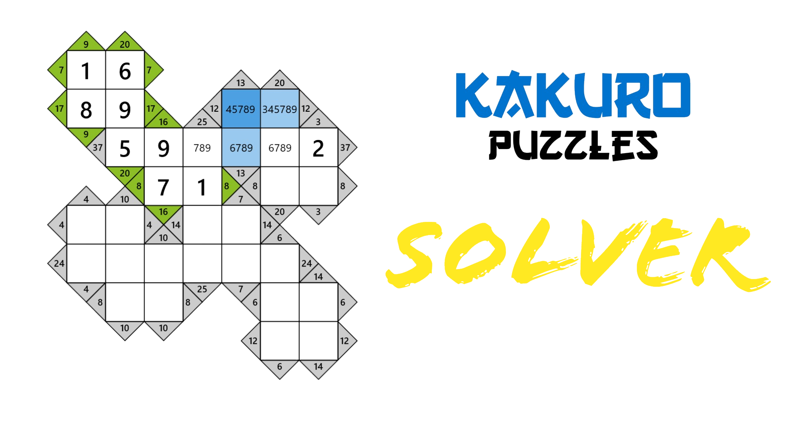

<p align="center">
    <a>
        
    </a>
    <br>
    <b>A Versatile and Efficient Kakuro Solver in Python</b>
    <br>
</p>


## KakuroSolver

Welcome to KakuroSolver, a powerful and elegant Python script that seamlessly solves Kakuro puzzles of any complexity. Built with a focus on modularity, efficiency, and user-friendliness, KakuroSolver empowers you to tackle even the most challenging Kakuro puzzles with ease.

### Introduction to Kakuro

Kakuro, also known as Cross Sum, is a logic-based number placement puzzle with a unique grid structure. The goal is to fill in the numbers from 1 to 9, ensuring that the sum of each column and row equals the indicated number in the corresponding clue cells.

### Key Features of KakuroSolver

* **Modular Design:** The code is neatly organized into well-defined modules, making it easy to understand, modify, and extend.

* **Efficient Optimization:** KakuroSolver employs intelligent optimization techniques to prune the search space and accelerate the solving process.

* **Constraint Satisfaction Problem (CSP) with Backtracking Algorithm:** The puzzle is represented as a CSP, and a backtracking algorithm is employed to systematically explore potential solutions.

* **Comprehensive Error Handling:** Robust error handling ensures that the solver gracefully handles invalid puzzles and provides informative feedback.

* **User-Friendly CLI Interface:** KakuroSolver provides a clean and intuitive command-line interface for interacting with the solver.

### Getting Started with KakuroSolver

To install KakuroSolver, simply execute the following command in your terminal:

```bash
git clone https://github.com/MohammadrezaAmani/Kakuro
```

Once installed, you can import the KakuroSolver module and start solving Kakuro puzzles:

```python
from kakuro import Game

board = """
#     #     #     24|#  16|#
#     #     6|17  ?     ?
#     17|18 ?     ?     ?
#|17  ?     ?     ?     #
#|11  ?     ?     #     #
"""

if __name__ == "__main__":
    game = Game(board)
    game.run(depth=3)
    game.ppint(indent=2)
```


### Conclusion

KakuroSolver is a powerful and versatile Kakuro solver that seamlessly tackles puzzles of any complexity. Its modular design, efficient optimization, and intuitive user interface make it an ideal tool for both novice and experienced Kakuro players.